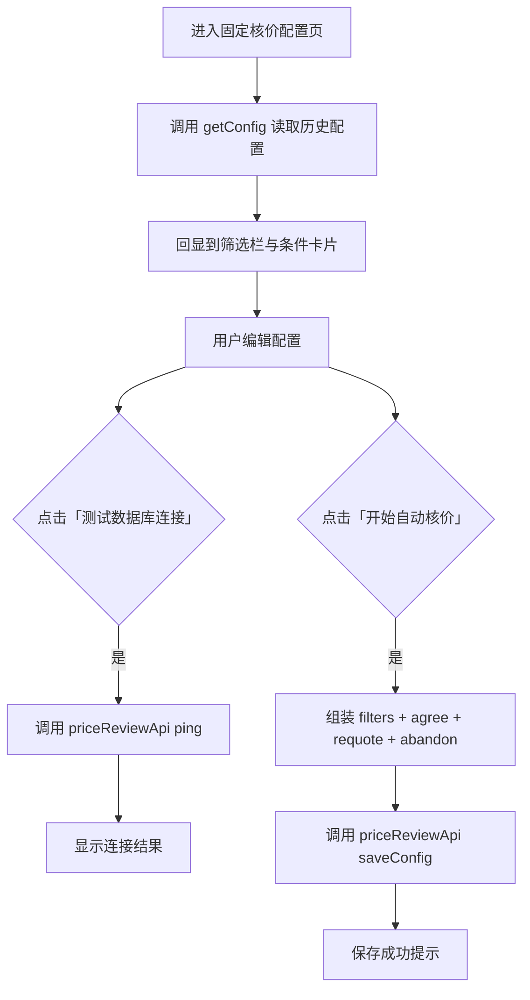

# 固定核价配置页 - 产品需求文档

## 1. 产品概述

TEMU 卖家后台的「固定核价」配置界面，用于按店铺、站点、SKC 等条件批量设置自动核价策略。用户配置完成后，点击「开始自动核价」即可保存配置并触发后续自动化流程。

## 2. 核心功能

### 2.1 功能模块

1. **固定核价配置页**：左侧双栏导航 + 右侧配置内容区，底部固定操作栏。
2. **筛选栏**：店铺、站点、SKC 筛选、开始时间、结束时间。
3. **同意核价条件**：支持三种定价方式 Tab 切换，含货号包含、官方申报价、最大同意上报价格。
4. **重新报价条件**：核价次数、降价百分比。
5. **放弃核价条件**：单选「拒绝，放弃上新」或「忽略，不处理」。
6. **数据库连接测试**：调用 CloudBase 云函数 `priceReviewApi` 的 `ping` 动作。
7. **配置保存与回显**：调用 `saveConfig` 保存配置，页面加载时调用 `getConfig` 回显历史配置。

### 2.2 页面详情

| 页面名称 | 模块名称 | 功能描述 |
|----------|----------|----------|
| 固定核价配置页 | 顶部筛选栏 | 店铺、站点、SKC、起止时间输入 |
| 固定核价配置页 | 同意核价条件卡片 | 三种定价方式 Tab、货号/申报价/最大上报价 |
| 固定核价配置页 | 重新报价条件卡片 | 核价次数、降价百分比 |
| 固定核价配置页 | 放弃核价条件卡片 | 放弃策略单选 |
| 固定核价配置页 | 底部操作栏 | 测试数据库连接、开始自动核价 |

## 3. 核心流程



## 4. 用户界面设计

### 4.1 设计风格

- **主色调**：白色/浅灰背景，绿色（`#10B981` / `emerald-500`）强调色。
- **按钮**：主要操作为绿色实心圆角按钮；次要操作为浅灰描边按钮。
- **输入框**：灰色背景 `bg-gray-50`，聚焦时绿色边框阴影。
- **卡片**：白色背景，底部细边框分隔，依次淡入动画。
- **布局尺寸**：桌面端优先，主侧边栏 220px，子侧边栏 160px，内容区最小宽度 1024px。
- **字体**：无衬线字体，保持中文界面清晰可读。
- **图标**：使用 Lucide React 图标库。

### 4.2 页面布局

```
┌─────────────────────────────────────────────────────────────┐
│  大卖家 Logo    TEMU  |  上品中心  |  店铺授权  ...          │  ← MainSidebar (220px)
├──────────┬──────────────────────────────────────────────────┤
│ 商品管理  │                                                  │
│ 同步库存  │  店铺 | 站点 | skc筛选 | 开始时间 | 结束时间      │  ← FilterBar
│ 成本核价  │                                                  │
│ 固定核价 →│  1、同意核价条件                                 │  ← AgreeConditionCard
│ 自动调价  │  [固定价格方式] [申报价比例] [货号包含的方式]    │
│ ...       │  当货号含有 | 官方申报价 | 最大同意上报价格      │
│           │                                                  │
│           │  2、重新报价条件                                 │  ← RequoteConditionCard
│           │  核价次数 | 则原申报价基础中降 %                 │
│           │                                                  │
│           │  3、放弃核价条件                                 │  ← AbandonConditionCard
│           │  [拒绝，放弃上新] [忽略，不处理]                 │
│           │                                                  │
│           │  [测试数据库连接]        [开始自动核价]          │  ← 底部操作栏
└──────────┴──────────────────────────────────────────────────┘
         ↑ SubSidebar (160px)
```

### 4.3 响应式

- 桌面端优先，内容区最小宽度 1024px。
- 侧边栏在小屏幕下可考虑隐藏或折叠（当前版本以桌面端为主）。

## 5. 后续扩展

1. 扩展重新报价原因字段，支持 `bargainReasonList` 与 `externalLinkList`。
2. 增加核价单列表页，支持对单个核价单执行同意/重新报价/放弃操作。
