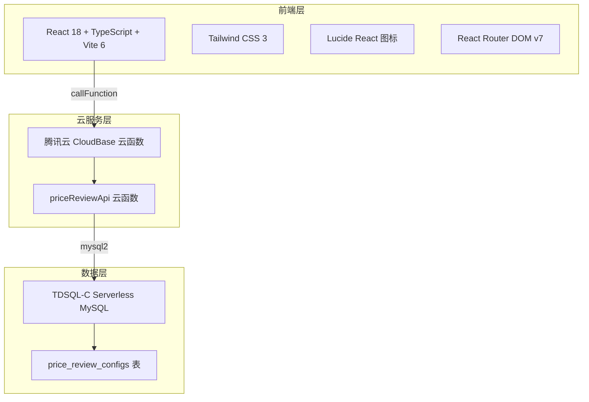
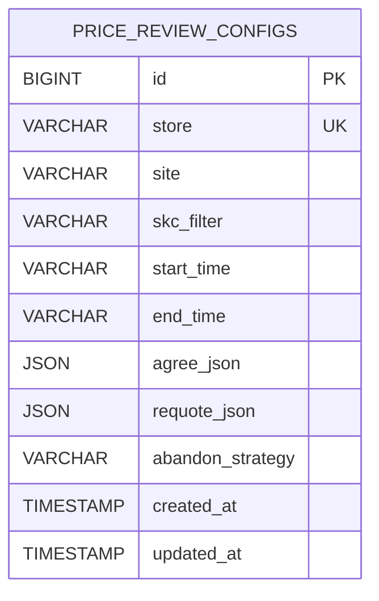

# 固定核价配置页 - 技术架构文档

## 1. 架构设计



## 2. 技术描述

- **前端框架**：React@18 + TypeScript
- **构建工具**：Vite@6
- **样式方案**：Tailwind CSS@3
- **图标库**：Lucide React
- **路由**：React Router DOM@7
- **状态管理**：React useState（本地状态）
- **云服务**：腾讯云 CloudBase
- **数据库**：TDSQL-C Serverless MySQL
- **数据库驱动**：mysql2（CloudBase 云函数内）

## 3. 路由定义

| 路由 | 用途 |
|------|------|
| `/` | 固定核价配置页 |

## 4. API 定义

### 4.1 CloudBase 云函数 `priceReviewApi`

**请求格式**：

```typescript
interface CloudBaseRequest {
  action: "ping" | "saveConfig" | "getConfig";
  data?: SaveConfigData | GetConfigData;
}
```

**保存配置请求**：

```typescript
interface SaveConfigData {
  store: string;
  site: string;
  skcFilter: string;
  startTime: string;
  endTime: string;
  agreeJson: AgreeCondition;
  requoteJson: RequoteCondition;
  abandonStrategy: "reject" | "ignore";
}
```

**读取配置请求**：

```typescript
interface GetConfigData {
  store: string;
}
```

**响应格式**：

```typescript
interface CloudBaseResponse<T = unknown> {
  code: number;
  message: string;
  data?: T;
}
```

## 5. 数据模型

### 5.1 页面级状态

```typescript
interface FilterState {
  store: string;
  site: string;
  skcFilter: string;
  startTime: string;
  endTime: string;
}

interface AgreeCondition {
  skuContains: string;
  officialPrice: string;
  maxReportPrice: string;
}

interface RequoteCondition {
  maxCheckCount: string;
  discountPercent: string;
}

type AbandonStrategy = "reject" | "ignore";
```

### 5.2 数据库表结构

表名：`price_review_configs`

| 字段 | 类型 | 说明 |
|------|------|------|
| `id` | BIGINT | 主键 |
| `store` | VARCHAR(64) | 店铺 ID，唯一键 |
| `site` | VARCHAR(16) | 站点 |
| `skc_filter` | VARCHAR(512) | SKC 筛选 |
| `start_time` | VARCHAR(32) | 开始时间 |
| `end_time` | VARCHAR(32) | 结束时间 |
| `agree_json` | JSON | 同意核价条件 |
| `requote_json` | JSON | 重新报价条件 |
| `abandon_strategy` | VARCHAR(16) | 放弃策略 |
| `created_at` | TIMESTAMP | 创建时间 |
| `updated_at` | TIMESTAMP | 更新时间 |

### 5.3 ER 图



## 6. 文件结构

| 文件 | 说明 |
|------|------|
| `src/pages/Home.tsx` | 页面主入口，组合所有组件，管理页面级状态 |
| `src/components/FilterBar.tsx` | 顶部筛选栏 |
| `src/components/AgreeConditionCard.tsx` | 同意核价条件卡片 |
| `src/components/RequoteConditionCard.tsx` | 重新报价条件卡片 |
| `src/components/AbandonConditionCard.tsx` | 放弃核价条件卡片 |
| `src/components/MainSidebar.tsx` | 左侧主导航栏 |
| `src/components/SubSidebar.tsx` | 左侧子导航栏 |
| `src/lib/cloudbase.ts` | CloudBase SDK 初始化与云函数调用封装 |
| `src/lib/utils.ts` | Tailwind 类名合并工具 `cn` |
| `src/hooks/useTheme.ts` | 主题切换 Hook（预留） |
| `cloudfunctions/priceReviewApi/index.js` | 云函数入口 |
| `cloudfunctions/priceReviewApi/schema.sql` | 数据库表结构 |

## 7. 部署说明

1. 在 TDSQL-C 执行 `cloudfunctions/priceReviewApi/schema.sql` 建表。
2. 在 CloudBase 控制台创建/部署云函数 `priceReviewApi`。
3. 配置云函数环境变量：`DB_HOST`、`DB_PORT`、`DB_USER`、`DB_PASSWORD`、`DB_NAME`。
4. 确保 CloudBase 云函数能访问 TDSQL-C 内网 IP。
5. 前端执行 `npm run build` 后部署到静态托管服务。
